# CGRA 2020/2021

## Screenshots

### 1 - MyFish

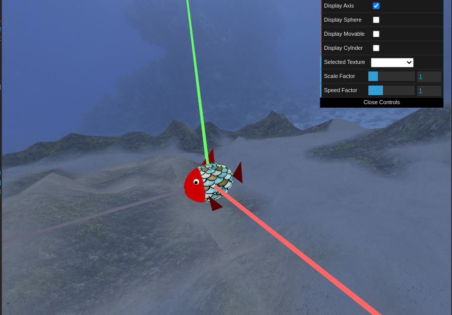

### 2 - Sea Floor

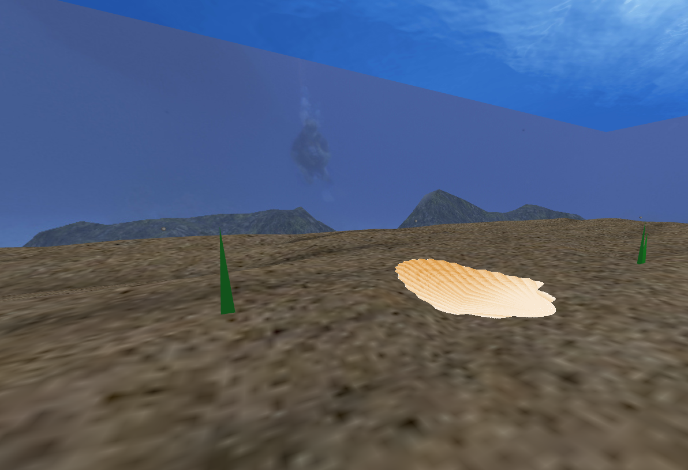

### 3 - Sea Surface

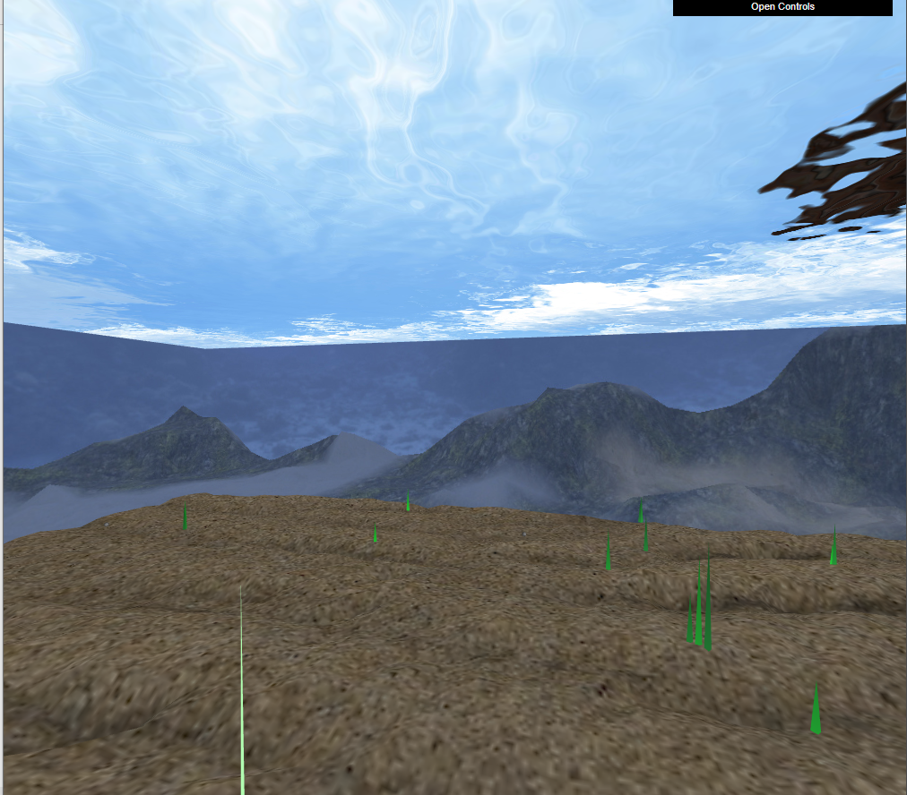
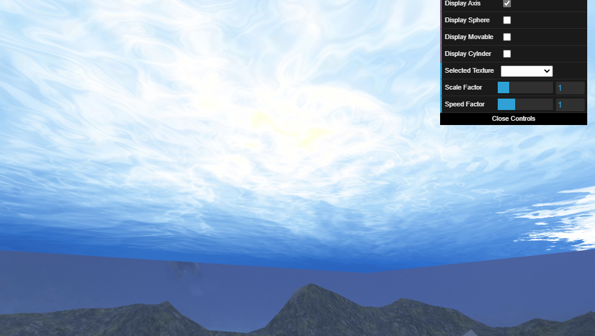

### 4 - Rocks

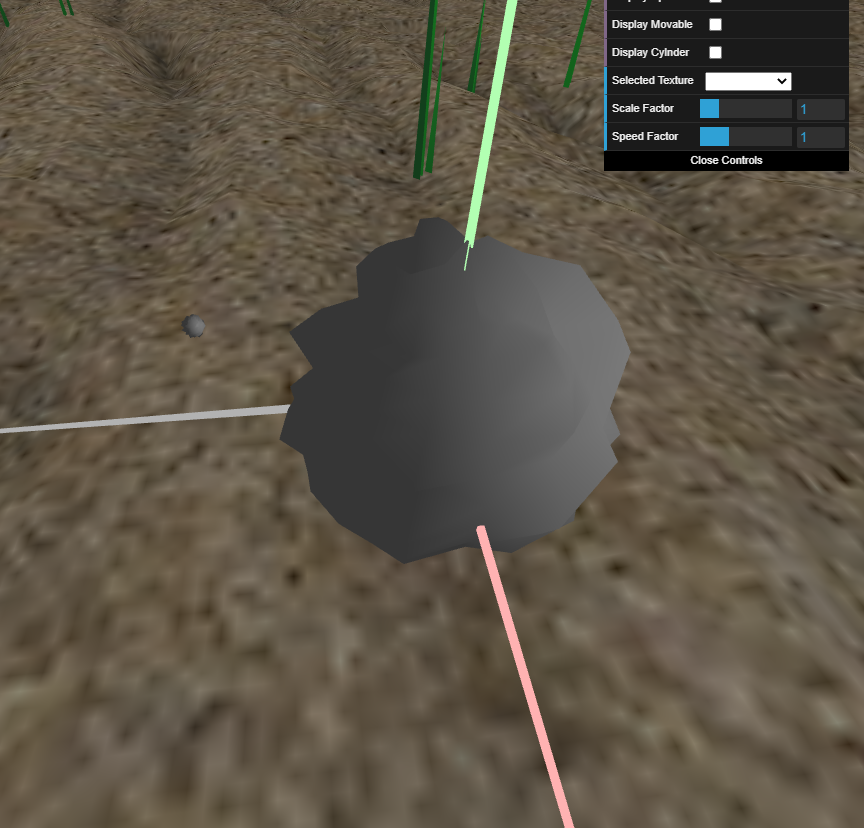
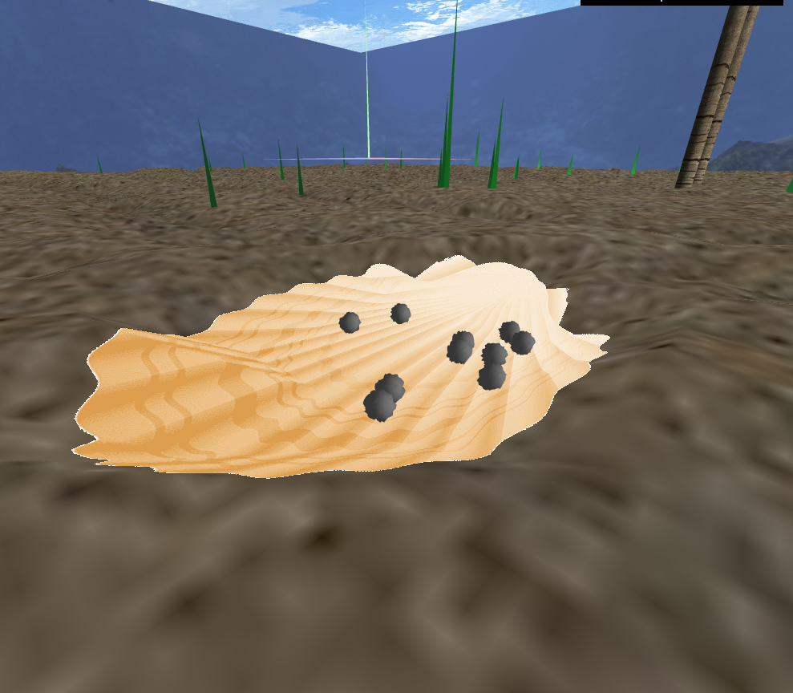

### 5 - MyPillar

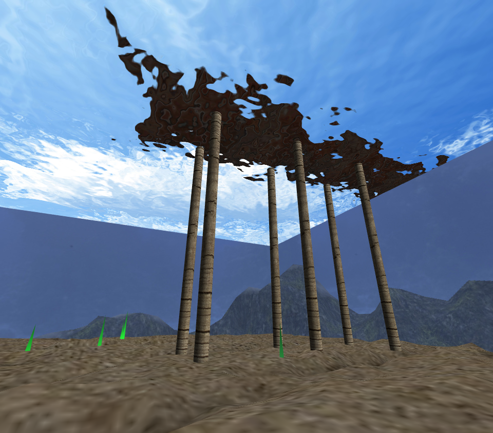

### 6 - CubeMap

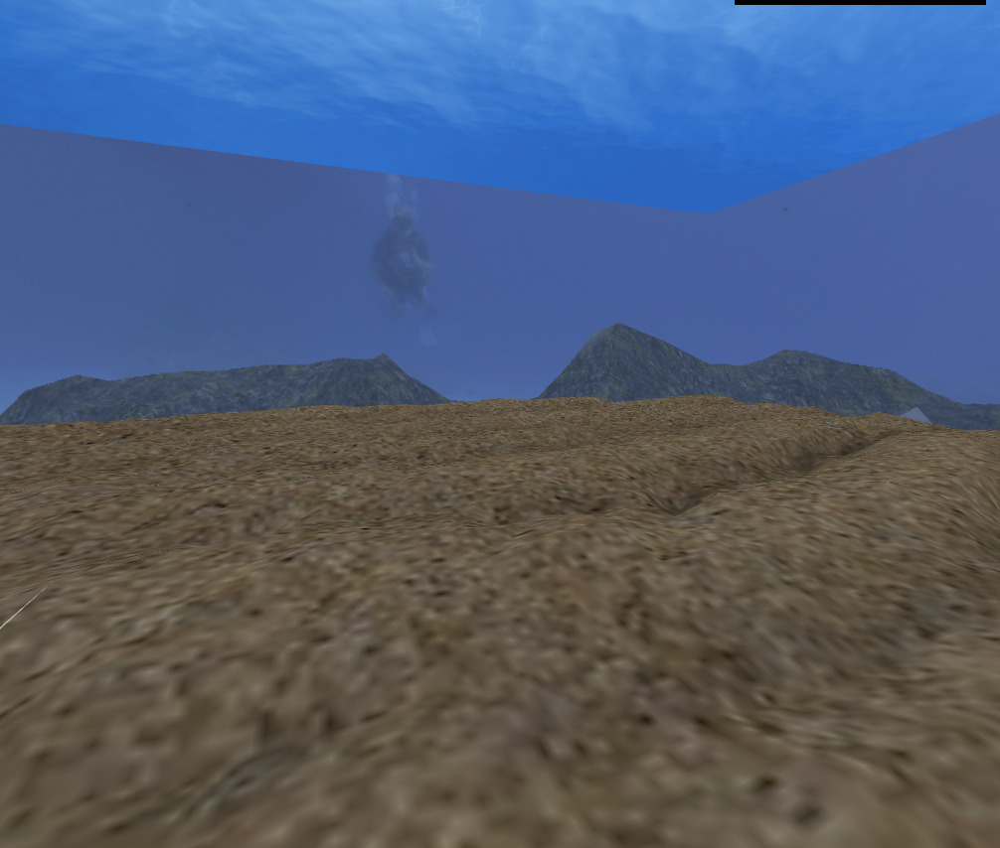

### 7 - Additional Control and Rocks Manipulation

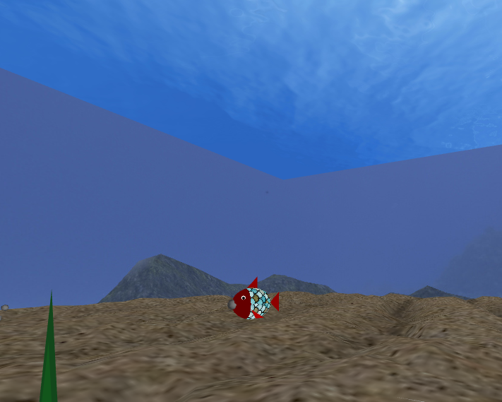
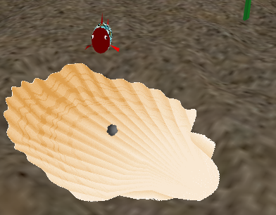
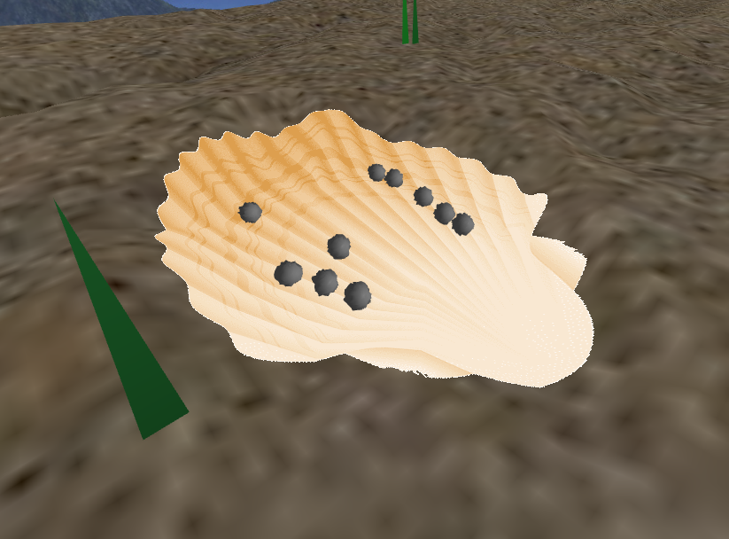

### 8 - Other Fuctionalities

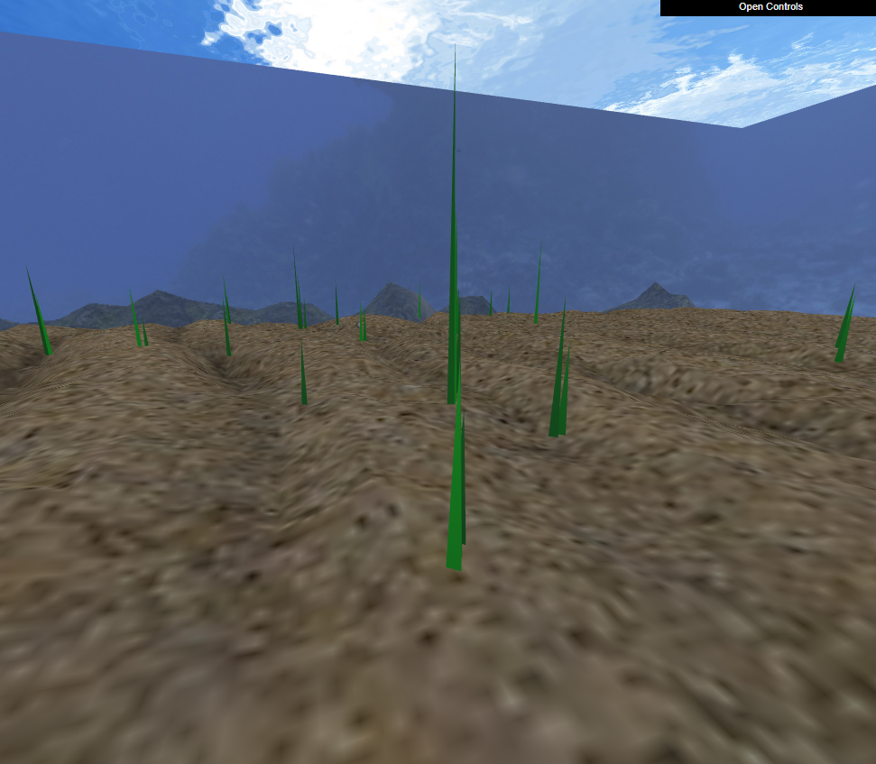
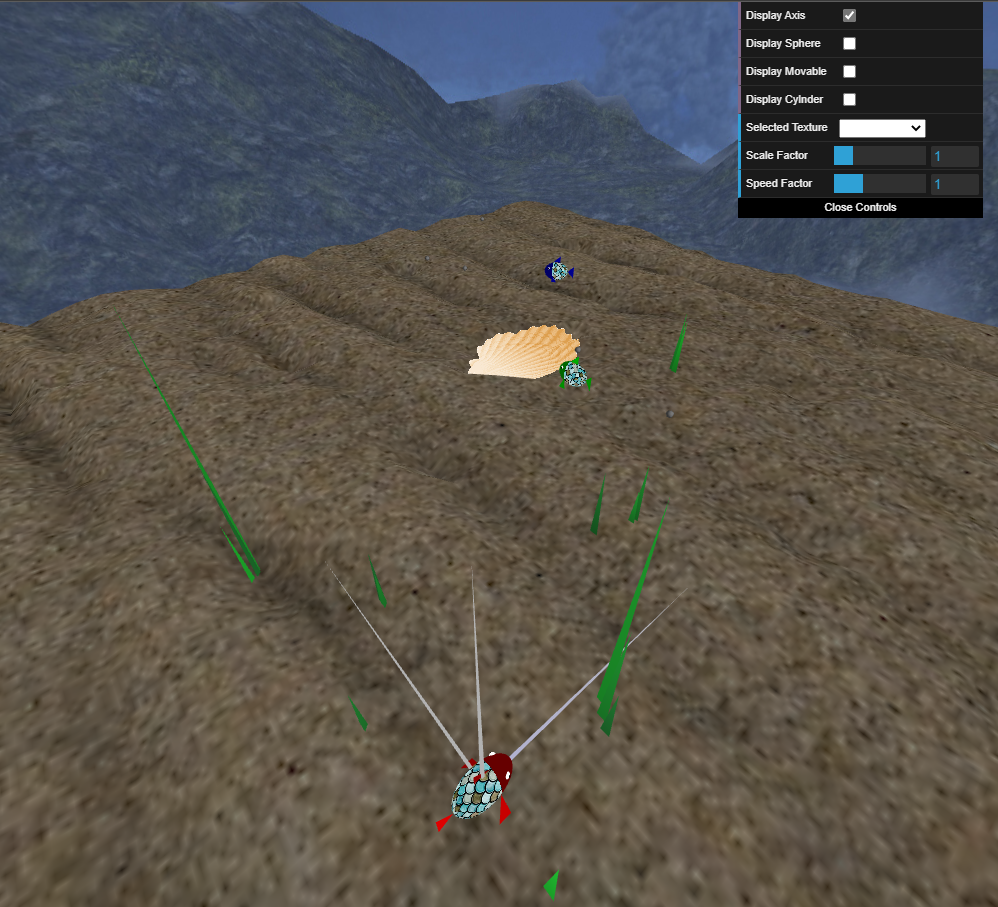
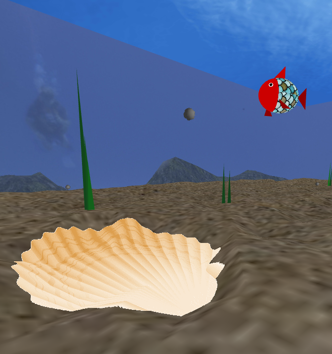

